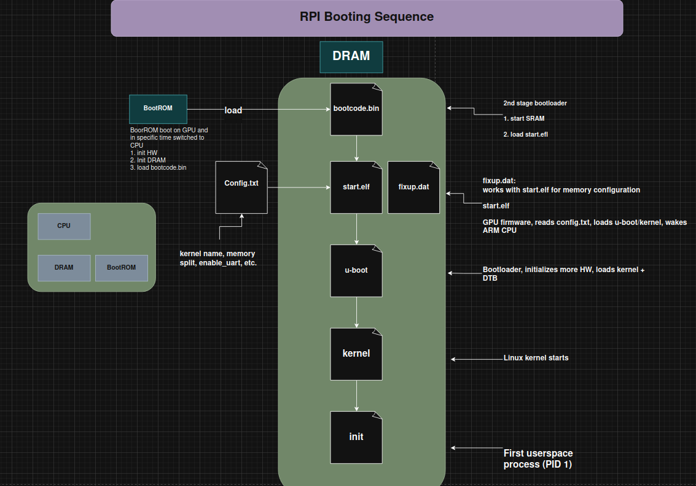
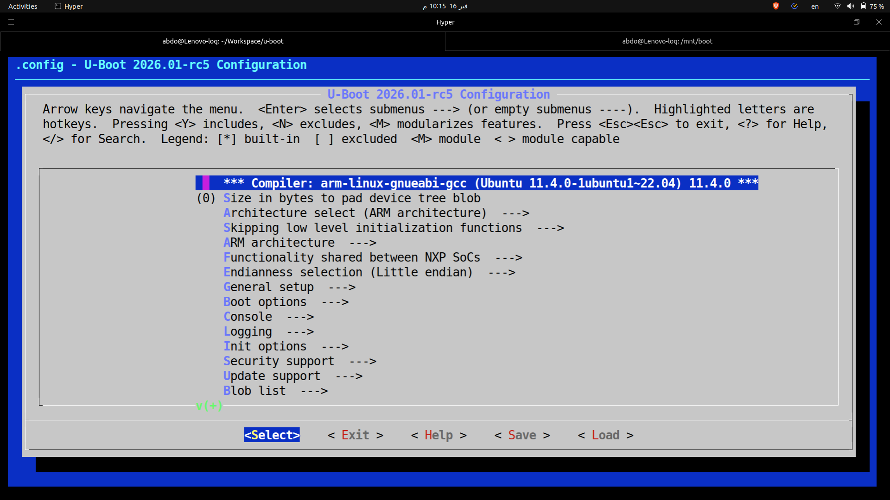

# 🚀 Embedded Linux Labs - U-Boot Build and Deployment

<div align="center">


**A comprehensive guide to understanding bootloaders, boot sequences, and building U-Boot for embedded systems.**

</div>

---

## 🔧 Question 1: What is a Bootloader?

### Definition

A **bootloader** is a small program that runs immediately after hardware power-on. It acts as the ignition system for the operating system.

### Key Responsibilities

| Responsibility | Description |
|----------------|-------------|
| 🔌 **Initialize Hardware** | Set up RAM, CPU clocks, serial console, storage devices |
| 📦 **Load the Kernel** | Copy the OS kernel from storage into RAM |
| 🔄 **Pass Control** | Transfer execution to the kernel with boot parameters |
| 📋 **Pass Device Tree** | Provide hardware description (DTB) to the kernel |
| 🖥️ **User Interface** | Provide prompt/menu for kernel selection (dual boot) |

### Common Bootloaders

| Bootloader | Target Platform |
|------------|-----------------|
| **U-Boot** | Embedded systems (ARM, MIPS, RISC-V) |
| **GRUB** | Desktop/Server PCs (x86/x86_64) |
| **LILO** | Legacy Linux systems |
| **Windows Boot Manager** | Windows OS |

---

## 🔄 Question 2: Boot Chain Sequences

### 🍓 Raspberry Pi Boot Chain

The Raspberry Pi has a unique boot sequence where the **GPU boots first**, not the CPU!



#### Boot Stages Explained

```
┌─────────────┐     ┌──────────────┐     ┌───────────┐     ┌─────────┐     ┌────────┐     ┌──────┐
│   BootROM   │────▶│ bootcode.bin │────▶│ start.elf │────▶│ U-Boot  │────▶│ Kernel │────▶│ Init │
│    (GPU)    │     │    (GPU)     │     │   (GPU)   │     │  (ARM)  │     │ (ARM)  │     │(ARM) │
└─────────────┘     └──────────────┘     └───────────┘     └─────────┘     └────────┘     └──────┘
```

| Stage | Component | Runs On | Description |
|-------|-----------|---------|-------------|
| 1 | **BootROM** | GPU | Hardcoded in SoC, initializes HW, loads bootcode.bin |
| 2 | **bootcode.bin** | GPU | Enables SDRAM, loads start.elf |
| 3 | **start.elf** | GPU | GPU firmware, reads config.txt, loads U-Boot, wakes ARM CPU |
| 4 | **U-Boot** | ARM CPU | Bootloader, initializes hardware, loads kernel + DTB |
| 5 | **Kernel** | ARM CPU | Linux kernel initializes system |
| 6 | **Init** | ARM CPU | First userspace process (PID 1) |

---

### 🖥️ PC Boot Chain (Bonus)


#### Boot Stages Explained

```
┌─────────────┐     ┌──────────────┐     ┌───────────┐     ┌─────────┐     ┌────────┐     ┌──────┐
│   BootROM   │────▶│    BIOS/     │────▶│  MBR/GPT  │────▶│  GRUB   │────▶│ Kernel │────▶│ Init │
│   (CPU)     │     │    UEFI      │     │           │     │         │     │        │     │      │
└─────────────┘     └──────────────┘     └───────────┘     └─────────┘     └────────┘     └──────┘
```

| Stage | Component | Description |
|-------|-----------|-------------|
| 1 | **BootROM** | CPU reads reset vector, jumps to BIOS |
| 2 | **BIOS/UEFI** | POST test, init keyboard/screen/RAM/storage |
| 3 | **MBR/GPT** | Master Boot Record contains Stage 1 bootloader |
| 4 | **GRUB** | 2nd stage bootloader, shows menu, loads kernel |
| 5 | **Kernel** | Linux kernel initializes, mounts root filesystem |
| 6 | **Init** | systemd/SysV starts services and GUI |

#### BIOS vs UEFI Comparison

| Feature | BIOS (Legacy) | UEFI (Modern) |
|---------|---------------|---------------|
| Partition Table | MBR | GPT |
| Boot File | MBR code | EFI executable (.efi) |
| Disk Size Limit | 2TB | 9+ ZB |
| Interface | Text-based | Graphical capable |

---

## ⚔️ Question 3: U-Boot vs GRUB

### Comparison Table

| Feature | **U-Boot** | **GRUB** |
|---------|------------|----------|
| **Full Name** | Universal Bootloader | GRand Unified Bootloader |
| **Target Systems** | 🔧 Embedded systems | 🖥️ Desktop/Server PCs |
| **Typical Devices** | Raspberry Pi, BeagleBone, Routers, IoT | Laptops, Desktops, Servers |
| **Architecture** | ARM, ARM64, MIPS, PowerPC, RISC-V, x86 | Primarily x86/x86_64 |
| **Storage Support** | SD card, eMMC, NAND, NOR flash, TFTP, USB | HDD, SSD, NVMe, USB |
| **Configuration** | Environment variables, scripts | grub.cfg file |
| **Network Boot** | ✅ Strong TFTP/NFS support | ⚠️ PXE support (less common) |
| **Firmware Interface** | Device Tree (DTB) | BIOS/UEFI |
| **Size** | 💾 Lightweight | 📦 Larger, feature-rich |
| **User Interface** | Command-line prompt | Graphical menu + CLI |

### When to Use Which?

```
┌─────────────────────────────────────────────────────────────┐
│                    CHOOSING A BOOTLOADER                     │
├─────────────────────────────────────────────────────────────┤
│                                                              │
│   Building an IoT device?        ──────▶  Use U-Boot 🔧     │
│   ARM/MIPS processor?            ──────▶  Use U-Boot 🔧     │
│   Need network boot (TFTP)?      ──────▶  Use U-Boot 🔧     │
│   Resource constrained?          ──────▶  Use U-Boot 🔧     │
│                                                              │
│   Desktop Linux installation?    ──────▶  Use GRUB 🖥️       │
│   x86/x86_64 server?             ──────▶  Use GRUB 🖥️       │
│   Need graphical boot menu?      ──────▶  Use GRUB 🖥️       │
│   Dual-boot with Windows?        ──────▶  Use GRUB 🖥️       │
│                                                              │
└─────────────────────────────────────────────────────────────┘
```

---

## 📁 Question 4: Raspberry Pi Boot Partition Files

### Required Files for U-Boot on Raspberry Pi

| File | Importance | Description |
|------|------------|-------------|
| 📄 **bootcode.bin** | 🔴 Critical | 2nd stage bootloader (GPU), enables SDRAM, loads start.elf |
| 📄 **start.elf** | 🔴 Critical | GPU firmware, reads config.txt, loads U-Boot, wakes ARM CPU |
| 📄 **fixup.dat** | 🔴 Critical | Memory configuration (GPU/ARM memory split) |
| 📄 **config.txt** | 🔴 Critical | Boot configuration file |
| 📄 **u-boot.bin** | 🔴 Critical | The U-Boot bootloader binary |
| 📄 **bcm2710-rpi-3-b-plus.dtb** | 🔴 Critical | Device Tree Blob - hardware description |

### config.txt for U-Boot

```ini
# Enable serial console for debugging
enable_uart=1

# Tell start.elf to load U-Boot instead of default kernel
kernel=u-boot.bin

# Enable 64-bit mode for AArch64 (RPi 3B+)
arm_64bit=1
```

### Boot Partition Structure

```
/boot/
├── bootcode.bin          # GPU 2nd stage bootloader
├── start.elf             # GPU firmware
├── fixup.dat             # Memory configuration
├── config.txt            # Boot configuration
├── u-boot.bin            # U-Boot bootloader
├── bcm2710-rpi-3-b-plus.dtb  # Device Tree
└── uboot.env             # U-Boot environment (optional)
```

---

## 🛠️ Question 5: Build & Test U-Boot in QEMU

### Step-by-Step Build Process

#### 1️⃣ Clone U-Boot Source

```bash
git clone https://github.com/u-boot/u-boot.git
cd u-boot
```

#### 2️⃣ Configure for QEMU ARM (Cortex-A9)

```bash
make qemu_arm_defconfig
```

#### 3️⃣ Customize via menuconfig

```bash
make menuconfig
```



#### 4️⃣ Build U-Boot

```bash
make -j$(nproc)
```


**Generated Files:**
| File | Description |
|------|-------------|
| `u-boot` | ELF executable |
| `u-boot.bin` | Binary image |
| `u-boot.srec` | S-record format |
| `u-boot-nodtb.bin` | Binary without device tree |
| `u-boot.sym` | Symbol file |
| `u-boot.lds` | Linker script |

#### 5️⃣ Run in QEMU

```bash
qemu-system-arm -M vexpress-a9 -kernel u-boot -nographic -sd sd.img
```

**Command Parameters:**
| Parameter | Description |
|-----------|-------------|
| `qemu-system-arm` | ARM system emulator |
| `-M vexpress-a9` | Machine: Versatile Express Cortex-A9 |
| `-kernel u-boot` | Load U-Boot as kernel |
| `-nographic` | Use terminal (no GUI) |
| `-sd sd.img` | Attach SD card image |

### U-Boot Running Successfully! 🎉


```
U-Boot 2026.01-rc5 (Feb 16 2026 - 22:16:08 +0200)

DRAM:    128 MiB
Core:    23 devices, 11 uclasses, devicetree: embed
Flash:   128 MiB
MMC:     mmci@5000: 0
Loading Environment from FAT... OK
In:      uart@9000
Out:     uart@9000
Err:     uart@9000
Net:     eth0: ethernet@3,02000000
Hit any key to stop autoboot: 0

u-boot-cmd => ls mmc 0:1
        31   Image
    262144   uboot.env

2 file(s), 0 dir(s)

u-boot-cmd =>
```

---

## 🍓 Question 6: Deploy U-Boot on Raspberry Pi 3B+

> ⏳ **Status: Pending** - This section will be completed when SD card is available.


---

## 🌳 Question 7: Hardware Description File

### What is the Device Tree?

The **Device Tree Blob (.dtb)** file provides hardware description to U-Boot and the Linux kernel on Raspberry Pi 3B+.

**Specific file:** `bcm2710-rpi-3-b-plus.dtb`

### Device Tree File Types

| Extension | Name | Description |
|-----------|------|-------------|
| `.dts` | Device Tree Source | Human-readable text format |
| `.dtb` | Device Tree Blob | Compiled binary format |
| `.dtsi` | Device Tree Include | Shared/common definitions |

### What Does It Describe?

```
┌─────────────────────────────────────────────────────────────┐
│                    DEVICE TREE CONTENTS                      │
├─────────────────────────────────────────────────────────────┤
│  🔲 CPU configuration and topology                          │
│  💾 Memory layout and regions                               │
│  🔌 Peripheral addresses (GPIO, I2C, SPI, UART)             │
│  ⚡ Interrupt mappings                                       │
│  🚌 Bus configurations                                       │
│  🔧 Clock sources and frequencies                           │
│  📍 Pin multiplexing                                         │
└─────────────────────────────────────────────────────────────┘
```

### When is DTB Loaded?

```
┌───────────┐     ┌───────────┐     ┌─────────┐     ┌────────┐
│ start.elf │────▶│  U-Boot   │────▶│ Kernel  │────▶│ Drivers│
│  (loads)  │     │ (passes)  │     │ (uses)  │     │ (init) │
└───────────┘     └───────────┘     └─────────┘     └────────┘
      │                 │                │               │
      ▼                 ▼                ▼               ▼
   Loads DTB      May modify      Uses DTB to      Initialize
   from SD        DTB entries     init hardware    peripherals
```

| Stage | Action |
|-------|--------|
| 1️⃣ **start.elf** | GPU firmware loads `.dtb` from SD card boot partition |
| 2️⃣ **U-Boot** | Receives DTB, may modify it, uses it for hardware access |
| 3️⃣ **Kernel** | U-Boot passes DTB address to kernel |
| 4️⃣ **Drivers** | Kernel uses DTB to initialize device drivers |

---


## 👤 Author

**Abdelfattah** 

---
