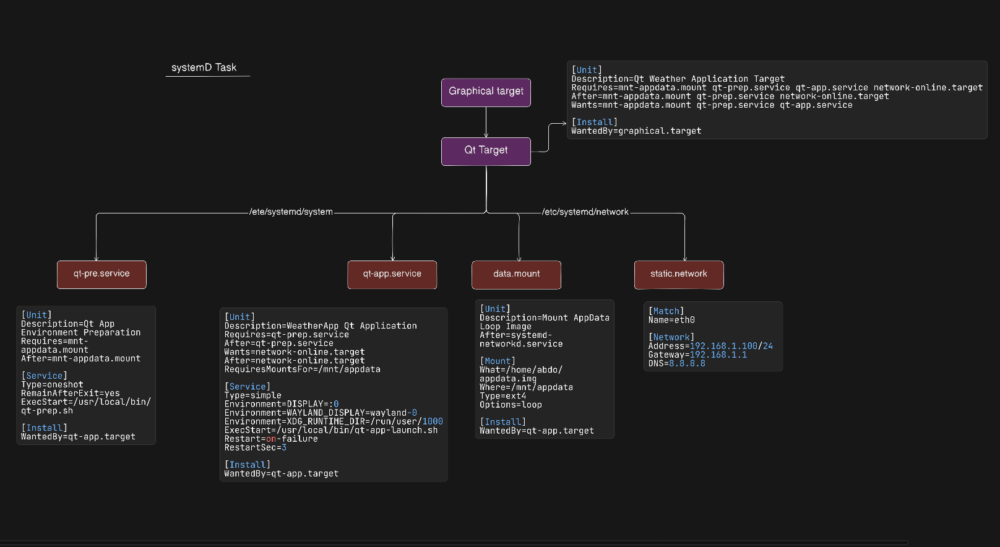
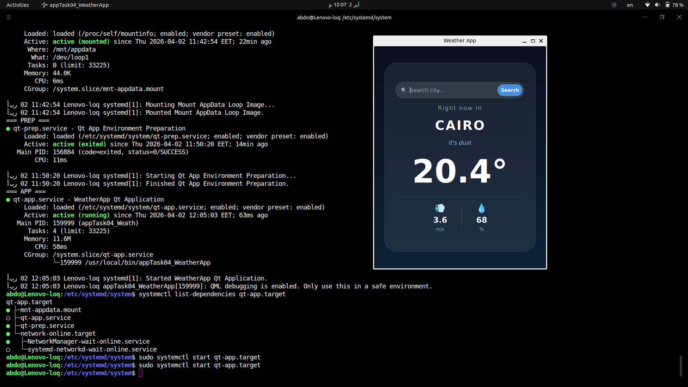

# Systemd Boot Design for Qt Weather Application

## Overview
This project demonstrates a systemd-based startup design for an embedded Linux system.
The Qt WeatherApp starts automatically at boot only after all required dependencies are ready.

---

## System Architecture

```
graphical.target
      └── qt-app.target
              ├── network-online.target  (static IP via systemd-networkd)
              ├── mnt-appdata.mount      (loop device mount)
              ├── qt-prep.service        (environment preparation)
              └── qt-app.service         (Qt application launcher)
```

---

## Files Created

| File | Location | Purpose |
|------|----------|---------|
| `10-static.network` | `/etc/systemd/network/` | Static IP configuration |
| `mnt-appdata.mount` | `/etc/systemd/system/` | Loop device mount unit |
| `qt-prep.service` | `/etc/systemd/system/` | Environment preparation service |
| `qt-app.service` | `/etc/systemd/system/` | Qt application service |
| `qt-app.target` | `/etc/systemd/system/` | Custom target grouping all units |
| `qt-prep.sh` | `/usr/local/bin/` | Preparation shell script |
| `qt-app-launch.sh` | `/usr/local/bin/` | Qt application launcher script |
| `appdata.img` | `/home/abdo/` | Loop filesystem image |

---

## Boot Sequence

```
1. systemd-networkd applies 10-static.network
         → eth0 receives static IP 192.168.1.100

2. mnt-appdata.mount activates
         → /home/abdo/appdata.img mounted at /mnt/appdata via loop device

3. qt-prep.service runs qt-prep.sh
         → creates /run/qt-app/
         → creates /var/log/qt-app/
         → validates mount content
         → validates binary exists
         → generates /run/qt-app/weather.conf

4. qt-app.service runs appTask04_WeatherApp
         → starts only after prep service completes
         → starts only after network is online
         → starts only after mount is available

5. qt-app.target reaches active state
         → all units are up and grouped
```

# Unit Files


# Final Output
