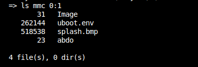

# Transfer File from PC to SD Card via U-Boot

This guide shows how to transfer a file from your PC to an SD card on VExpress board using U-Boot with TFTP and cp commands.

## Method 1: Using cp Command (RAM Copy)

This method loads the file to RAM, copies it to another RAM location using `cp`, then writes to SD card.

### Steps:

```bash
# 1. Configure network in U-Boot
setenv ipaddr 192.168.1.50          # Board IP
setenv serverip 192.168.1.100       # PC IP (TFTP server)

# 2. Load file from PC to RAM via TFTP
tftp $kernel_addr_r abdo
# Note: filesize variable is automatically set

# 3. Check transferred file size
printenv filesize

# 4. Copy file to another RAM location using cp
cp.b $kernel_addr_r 0x62000000 $filesize
# This copies from kernel_addr_r to 0x62000000

# 5. Initialize SD card
mmc dev 0
mmc rescan

# 6. Write from RAM to SD card FAT partition
fatwrite mmc 0:1 0x62000000 abdo $filesize
# mmc 0:1 = device 0, partition 1
# 0x62000000 = source address (where cp copied to)
# abdo = filename on SD card
# $filesize = size to write

# 7. Verify file on SD card
fatls mmc 0:1
```

### Memory Layout:
```
RAM:
├─ $kernel_addr_r (e.g., 0x60000000)  ← TFTP loads here
│  [File data from TFTP]
│
├─ 0x62000000                          ← cp copies to here
   [Copied file data] ──────────────────→ Written to SD card
```

## Method 2: Direct Write (Without cp)

This method writes directly to SD card without using `cp` command - **faster and simpler**.

### Steps:

```bash
# 1. Configure network
setenv ipaddr 192.168.1.50
setenv serverip 192.168.1.100

# 2. Load file from PC to RAM via TFTP
tftp $kernel_addr_r abdo

# 3. Initialize SD card
mmc dev 0
mmc rescan

# 4. Write directly to SD card (skip cp step)
fatwrite mmc 0:1 $kernel_addr_r abdo $filesize
# Writes directly from kernel_addr_r to SD card

# 5. Verify
fatls mmc 0:1
```
### Verify file on SD card:
```bash
ls mmc 0:1
```



