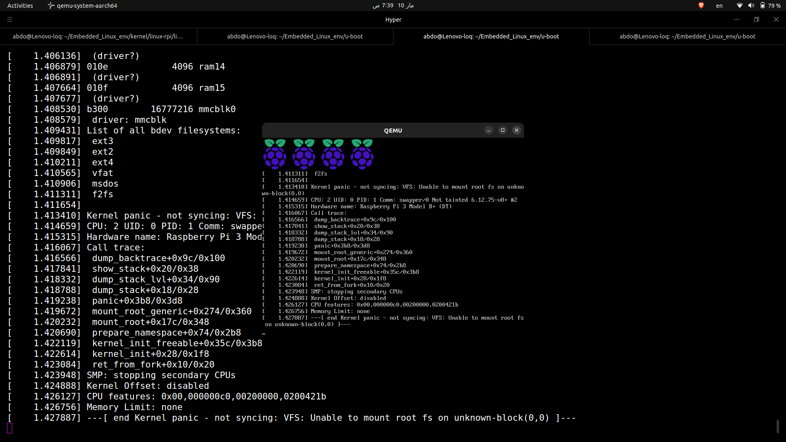
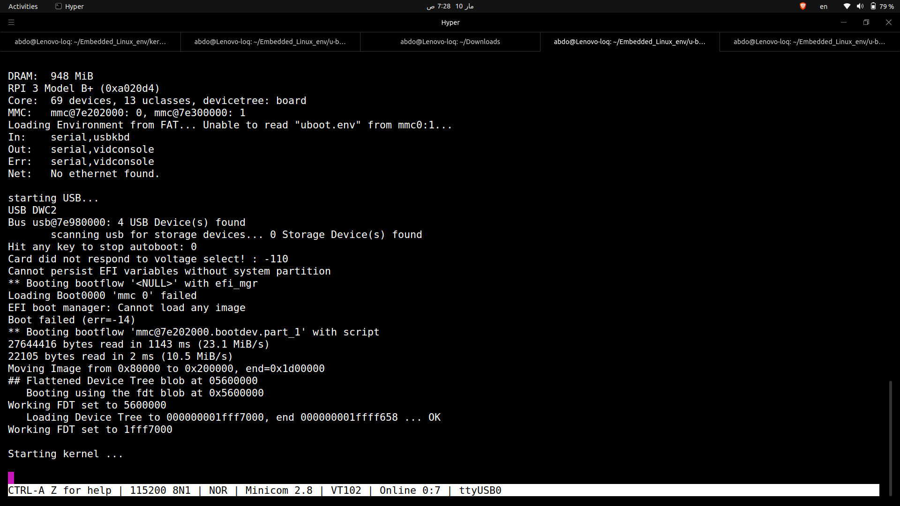

# Booting Linux Kernel on Raspberry Pi 3B+ using U-Boot

Boot Linux Kernel on Raspberry Pi 3B+ using U-Boot bootloader
and reach **Kernel Panic** (no rootfs) as proof of successful
kernel loading.

---

## 🗺️ Boot Flow
```
Power On
   ↓
GPU Firmware (bootcode.bin + start.elf)
   ↓
U-Boot (u-boot.bin)  ← our bootloader
   ↓
boot.scr             ← our boot script
   ↓
Linux Kernel (Image) ← our compiled kernel
   ↓
🔥 Kernel Panic      ← SUCCESS! No rootfs
```

---

## 🛠️ Tools & Environment

| Tool | Purpose |
|------|---------|
| `aarch64-rpi3-linux-gnu-gcc` | Cross compiler for RPi3 |
| `U-Boot 2026.01-rc5` | Bootloader |
| `Linux Kernel (linux-rpi)` | Kernel source |
| `QEMU 6.2+` | Virtual testing |
| `dd` | Create/Flash SD card image |
| `fdisk` | Partition SD card |
| `mkfs.vfat` | Format boot partition |
| `mkimage` | Create U-Boot scripts |

---

## 📁 Project Structure

```
Embedded_Linux_env/
├── u-boot/                          # U-Boot source & build
│   ├── u-boot.bin                   # Compiled bootloader
│   └── boot.cmd                     # Boot script source
├── kernel/
│   └── linux-rpi/linux/
│       └── arch/arm64/boot/
│           ├── Image                # Compiled kernel
│           └── dts/broadcom/
│               └── bcm2837-rpi-3-b-plus.dtb  # Device tree
└── rpi-env/
    ├── rpi-firmware/                # RPi GPU firmware files
    │   ├── bootcode.bin
    │   ├── start.elf
    │   └── fixup.dat
    └── virtual_SD-Card/
        └── rpi3-b-plus.img         # Virtual SD card image
```

---

## ⚙️ Step 1 — Cross Compiler Setup

```bash
# Set cross compiler environment variables
export ARCH=arm64
export CROSS_COMPILE=~/x-tools/aarch64-rpi3-linux-gnu/bin/aarch64-rpi3-linux-gnu-

```

---

## ⚙️ Step 2 — Compile U-Boot

```bash
cd ~/Embedded_Linux_env/u-boot

# Load RPi 3B+ default config
make rpi_3_b_plus_defconfig

# Compile
make -j$(nproc)

# Verify output
ls -lh u-boot.bin
```


## ⚙️ Step 3 — Compile Linux Kernel

```bash
cd ~/Embedded_Linux_env/kernel/linux-rpi/linux

# Load RPi3 default config
make bcm2811_defconfig

# Compile kernel
make -j$(nproc) Image

# Verify output
ls -lh arch/arm64/boot/Image
```

**Expected Output:**
```
Image  ~27MB
```

---

## ⚙️ Step 4 — Get RPi Firmware Files

```bash
mkdir -p ~/Embedded_Linux_env/rpi-env/rpi-firmware
cd ~/Embedded_Linux_env/rpi-env/rpi-firmware

# Base URL
URL="https://github.com/raspberrypi/firmware/raw/master/boot"

# Download required files
wget $URL/bootcode.bin
wget $URL/start.elf
wget $URL/fixup.dat

# Verify
ls -lh
```

**Expected Files:**
```
bootcode.bin   ~52K
start.elf      ~2.9M
fixup.dat      ~7.2K
```

---

## ⚙️ Step 5 — Create Virtual SD Card

### 5.1 Allocate 16GB Image File
```bash
cd ~/Embedded_Linux_env/rpi-env/virtual_SD-Card

# Create empty 16GB image
# bs=16M × count=1024 = 16GB
dd if=/dev/zero of=rpi3-b-plus.img bs=16M count=1024
```

---

### 5.2 Partition The Image

```bash
# Open fdisk on image
cfdik rpi3-b-plus.img
```


---

### 5.3 Attach Image to Loop Device

```bash
# Attach image as loop device
sudo losetup -f --show --partscan rpi3-b-plus.img
```

**Expected Output:**
```
/dev/loopx
```

```bash
# Verify partitions detected
lsblk /dev/loopx
```

```
NAME       SIZE
loop0       16G
├─loop0p1  200M   ← boot partition
└─loop0p2  15.8G  ← rootfs partition
```

---

### 5.4 Format Partitions

```bash
# Format boot partition as FAT32
sudo mkfs.vfat -F 32 -n "boot" /dev/loop0p1

# Format rootfs as ext4
sudo mkfs.ext4 -L "rootfs" /dev/loop0p2
```

---

### 5.5 Mount & Copy Files

```bash
# Create mount points
mkdir -p /mnt/boot

# Mount boot partition
sudo mount /dev/loop0p1 /mnt/boot

# Copy RPi firmware
sudo cp rpi-firmware/bootcode.bin          /mnt/boot/
sudo cp rpi-firmware/start.elf             /mnt/boot/
sudo cp rpi-firmware/fixup.dat             /mnt/boot/

# Copy DTB
sudo cp kernel/linux-rpi/linux/arch/arm64/boot/dts/broadcom/bcm2837-rpi-3-b-plus.dtb /mnt/boot/

# Copy Kernel
sudo cp kernel/linux-rpi/linux/arch/arm64/boot/Image /mnt/boot/

# Copy U-Boot
sudo cp u-boot/u-boot.bin /mnt/boot/
```

---

### 5.6 Create config.txt

```bash
sudo nano /mnt/boot/config.txt
```

```ini
# Tell GPU to load U-Boot instead of kernel
kernel=u-boot.bin

# Enable 64-bit mode
arm_64bit=1

# Enable UART for serial output
enable_uart=1
```

---

### 5.7 Create U-Boot Boot Script

```bash
# Create boot script source
nano ~/Embedded_Linux_env/u-boot/boot.cmd
```

```bash
# Load Kernel Image into RAM
fatload mmc 0:1 0x80000 Image

# Load Device Tree Blob into RAM  
fatload mmc 0:1 0x2600000 bcm2837-rpi-3-b-plus.dtb

# Set kernel boot arguments
setenv bootargs "console=ttyAMA0,115200 console=tty1 earlyprintk ignore_loglevel"

# Boot the kernel
# booti <kernel_addr> <initramfs (none)> <dtb_addr>
booti 0x80000 - 0x2600000
```


```bash
# Copy to SD card
sudo cp boot.scr /mnt/boot/

# Unmount
sudo umount /mnt/boot
sudo losetup -d /dev/loop0
```

---

### 5.8 Verify SD Card Contents

```bash
sudo losetup -f --show --partscan rpi3-b-plus.img
sudo mount /dev/loop0p1 /mnt/boot
ls -lh /mnt/boot/
```

---

## 🖥️ Step 6 — Test U-Boot on QEMU

### 6.1 Run QEMU

```bash
sudo qemu-system-aarch64 \
    -M raspi3b \
    -cpu cortex-a53 \
    -m 1024 \
    -kernel ~/Embedded_Linux_env/u-boot/u-boot.bin \
    -dtb ~/Embedded_Linux_env/kernel/linux-rpi/linux/arch/arm64/boot/dts/broadcom/bcm2837-rpi-3-b-plus.dtb \
    -device usb-kbd \
    -drive format=raw,file=~/Embedded_Linux_env/rpi-env/virtual_SD-Card/rpi3-b-plus.img,if=sd \
    -serial stdio \
    -display sdl \
    -no-reboot
```

**QEMU Flags Breakdown:**
```
-M raspi3b    → Emulate Raspberry Pi 3B machine
-cpu cortex-a53 → RPi3 CPU type
-m 1024       → 1GB RAM
-kernel       → Binary to load directly (u-boot.bin)
-dtb          → Device Tree for the machine
-device usb-kbd → Enable USB keyboard in QEMU
-drive        → SD card: format=raw, connected as SD
-serial stdio → UART output → your terminal
-display sdl  → Show QEMU graphical window
-no-reboot    → Stop instead of reboot (see panic!)
```


### 6.3 QEMU Output Screenshot


---

## 🔌 Step 7 — Flash & Test on Real RPi 3B+

### 7.1 Flash Image to Real SD Card

```bash
# Find SD card device
lsblk

# Unmount if auto-mounted
sudo umount /dev/sdb1
sudo umount /dev/sdb2

# Flash image to SD card (replace sdb with your device!)
sudo dd \
    if=~/Embedded_Linux_env/rpi-env/virtual_SD-Card/rpi3-b-plus.img \
    of=/dev/sdb \
    bs=4M \
    status=progress

# Flush buffers
sync
```

### 7.2 Hardware Connections

```
USB-TTL Cable    →    RPi 3B+ GPIO Header
──────────────────────────────────────────
GND (Black)      →    Pin 6  (GND)
TX  (Yellow)     →    Pin 10 (RXD0) ← RPi RX
RX  (White)      →    Pin 8  (TXD0) ← RPi TX
```

### 7.3 Open Serial Monitor

```bash
# Find USB-TTL device
ls /dev/ttyUSB*

# Open serial at 115200 baud
sudo picocom -b 115200 /dev/ttyUSB0
```

### 7.4 Real RPi Output Screenshot




---
## 🎯 Results

### QEMU Result
```
U-Boot 2026.01-rc5-dirty
DRAM:  960 MiB
RPI 3 Model B (0xa02082)
...
Starting kernel ...
[Kernel Panic - No rootfs] ← SUCCESS! ✅
```

### Real RPi 3B+ Result
```
U-Boot 2026.01-rc5-dirty
DRAM:  948 MiB
RPI 3 Model B+ (0xa020d4)  ← Real Hardware! ✅
...
27644416 bytes read (Image) ← Kernel loaded! ✅
22105 bytes read (DTB)      ← DTB loaded! ✅
Starting kernel ...         ← Kernel running! ✅
```


