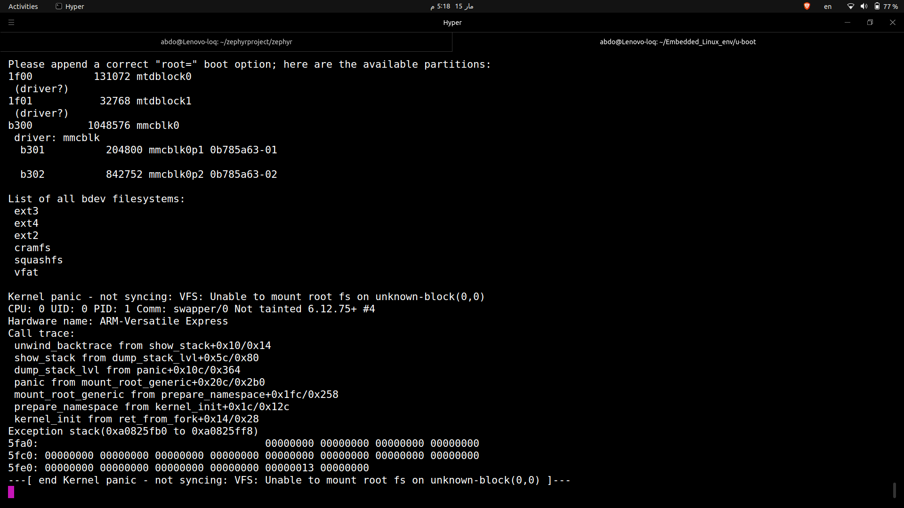
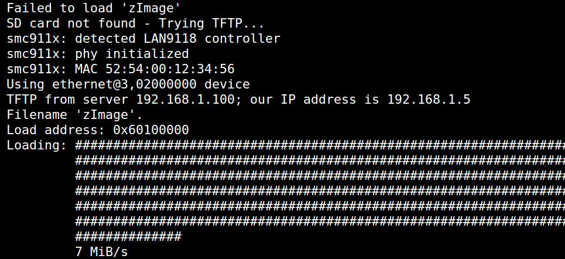

# Lab 6 - Build and Boot Custom Linux Kernel

## Table of Contents
1. [Lab Overview](#overview)
2. [Environment Setup](#setup)
3. [Kernel Build - QEMU](#kernel-qemu)
4. [QEMU Boot](#qemu-boot)
5. [U-Boot Bootscript](#bootscript)
6. [Theory Questions](#theory)

---

## 1. Lab Overview
The goal of this lab is to:
- Build a custom Linux kernel from source
- Add personal signature to kernel version
- Boot on QEMU vexpress-A9 (ARM32)
- Write U-Boot bootscript with SD/TFTP fallback
- Achieve the Kernel Panic trophy 🏆

---

## 2. Environment Setup

### Host Machine:
```
OS        : Ubuntu 22.04
Arch      : x86_64
Toolchain : arm-cortexa9_neon-linux-gnueabihf-
            (built with crosstool-NG)
QEMU      : qemu-system-arm
```

### Add Toolchain To PATH:
```bash
export PATH=$HOME/x-tools/arm-cortexa9_neon-linux-gnueabihf/bin:$PATH
```

### Verify Toolchain:
```bash
arm-cortexa9_neon-linux-gnueabihf-gcc --version
```

---

## 3. Kernel Build - QEMU (ARM32)

### Step 1: Create Working Directory
```bash
mkdir -p ~/Embedded_Linux_env/kernel && cd ~/Embedded_Linux_env/kernel
```

### Step 2: Clone Linux Kernel
```bash
git clone --depth=1 --branch v6.6 https://github.com/torvalds/linux.git
cd linux
```
> We clone from torvalds/linux (mainline) because:
> - vexpress-A9 is a virtual QEMU board
> - Fully supported in mainline kernel
> - No special hardware patches needed

### Step 3: Load vexpress Default Config
```bash
make ARCH=arm \
     CROSS_COMPILE=arm-cortexa9_neon-linux-gnueabihf- \
     vexpress_defconfig
```
> vexpress_defconfig = pre-made config for vexpress boards
> Lives in arch/arm/configs/vexpress_defconfig

### Step 4: Add Personal Signature
```bash
make ARCH=arm \
     CROSS_COMPILE=arm-cortexa9_neon-linux-gnueabihf- \
     menuconfig
```
```
Navigate to:
  General Setup
    → Local version - append to kernel release
    → Enter: -Abdelfattah-v1
  Save & Exit
```

### Step 5: Verify Signature
```bash
grep "CONFIG_LOCALVERSION" .config
```
Expected output:
```
CONFIG_LOCALVERSION="-Abdelfattah-v1"
```

### Step 6: Build Kernel
```bash
make ARCH=arm \
     CROSS_COMPILE=arm-cortexa9_neon-linux-gnueabihf- \
     -j$(nproc) zImage dtbs
```
> - zImage  → compressed kernel for ARM32
> - dtbs    → device tree blobs for all boards
> - -j$(nproc) → use all CPU cores for faster build

### Step 7: Verify Build Output
```bash
ls -lh arch/arm/boot/zImage
ls -lh arch/arm/boot/dts/arm/vexpress-v2p-ca9.dtb
```
Expected:
```
-rwxrwxr-x 1 abdo abdo 5.7M zImage
-rw-rw-r-- 1 abdo abdo  14K vexpress-v2p-ca9.dtb
```

---

## 4. QEMU Boot

### Boot Command:
```bash
qemu-system-arm \
    -M vexpress-a9 \
    -kernel arch/arm/boot/zImage \
    -dtb arch/arm/boot/dts/arm/vexpress-v2p-ca9.dtb \
    -append "console=ttyAMA0 panic=1" \
    -nographic
```

### Parameters Explained:
```
-M vexpress-a9  → emulate vexpress-A9 board
-kernel         → path to our zImage
-dtb            → path to device tree blob
-append         → kernel boot arguments
-nographic      → output to terminal (no GUI)
```

### Expected Result:
```
Linux version 6.12.75-Abdelfattah-v1+
...
Kernel panic - not syncing: VFS: Unable to mount root fs
```
> This panic = SUCCESS! 🏆
> Kernel fully booted but found no rootfs
> (rootfs will be added in Lab 07)

### Exit QEMU:
```
Ctrl+A then X
```

### Screenshot - Kernel Panic Trophy:


---

## 5. U-Boot Bootscript

### Boot Logic:
```
Power ON
   ↓
Try SD card (mmc 0:1)
   ↓ if failed
Try TFTP from laptop
   ↓ if failed
Print error message
```

### Assign bootargs in u-boot:
```bash
setenv bootargs "if fatload mmc 0:1 ${kernel_addr_r} zImage; then
    if fatload mmc 0:1 ${fdt_addr_r} vexpress-v2p-ca9.dtb; then
        setenv bootargs "console=ttyAMA0,115200 root=/dev/mmcblk0p2 rootfstype=ext4"
        bootz ${kernel_addr_r} - ${fdt_addr_r}
    else
        echo "ERROR: Failed to load DTB from SD card"
    fi
else
    echo "SD card not found - Trying TFTP..."
    if tftp ${kernel_addr_r} zImage; then
        if tftp ${fdt_addr_r} vexpress-v2p-ca9.dtb; then
            setenv bootargs "console=ttyAMA0,115200"
            bootz ${kernel_addr_r} - ${fdt_addr_r}
        else
            echo "ERROR: Failed to load DTB via TFTP"
        fi
    else
        echo "ERROR: All boot methods failed!"
        echo "Please check SD card or TFTP server"
    fi
fi"
```

### Screenshot - TFTP Fallback Working:


---

## 6. Theory Questions & Answers

### Q1: Monolithic vs Microkernel?

**Monolithic Kernel:**
```
→ Entire kernel runs in ONE address space
→ All services together:
   memory management, drivers, filesystem, network
→ FAST (no communication overhead)
→ Risk: one bug can crash entire system
→ Examples: Linux, BSD
```

**Microkernel:**
```
→ Kernel is TINY (only IPC + memory + scheduling)
→ Everything else runs as SEPARATE processes
→ SAFER (one crash doesn't kill system)
→ SLOWER (processes must communicate)
→ Examples: QNX, MINIX, L4
```

**Where Does Linux Stand?**
```
Linux = Modular Monolithic Kernel
→ Core is monolithic (fast)
→ Drivers loadable as modules
→ Best of both worlds!
```

---

### Q2: Why Linux Instead of QNX in Embedded?

```
1. Cost 💰
   → Linux = FREE
   → QNX  = expensive license
   → millions of devices × license = huge savings

2. Community 👥
   → thousands of contributors
   → bugs fixed quickly
   → QNX = small closed team

3. Hardware Support 🔧
   → Linux supports almost every chip
   → QNX = limited hardware support

4. Ecosystem 📦
   → huge software library
   → Android, Yocto, Buildroot all built on Linux
   → free toolchains and debuggers

5. Flexibility 🔄
   → customize everything
   → remove/add what you need
```

**Where QNX Wins:**
```
→ Hard real-time systems
→ Safety critical: medical, aviation, nuclear
→ Guaranteed response time
→ Linux cannot guarantee this!
```

---

### Q3: What is Android GKI?

**Problem Before GKI:**
```
Samsung  → modifies kernel their way
Xiaomi   → modifies kernel their way
Qualcomm → modifies kernel their way
Result   → 1000s of different kernels!
→ Security patches take months to reach devices
→ Android updates become impossible
→ Devices stop getting updates after 2 years
```

**GKI Solution:**
```
GKI = Generic Kernel Image

Structure:
┌─────────────────────────┐
│   GKI Core Kernel       │ ← Google controls
├─────────────────────────┤
│   Vendor Modules        │ ← Vendors add here only
└─────────────────────────┘
```

**Why Forced From Android 13?**
```
→ Before = optional → vendors ignored it
→ Android 13 = MANDATORY
→ No GKI = No Google certification
→ No certification = No Play Store
→ No Play Store = Phone won't sell!
```

---

### Q4: Why raspberrypi/linux Instead of torvalds/linux for RPi?

```
torvalds/linux  → mainline kernel
                → generic, supports many platforms
                → vexpress-A9 fully supported

raspberrypi/linux → RPi team forked mainline
                  → added their own patches:
                    - VideoCore GPU driver
                    - Custom clock drivers
                    - Board specific fixes
                  → NOT merged to mainline yet!
                  → Use on real RPi hardware
                  → torvalds/linux = some hardware won't work
```

---

### Q5: Kernel Image Types

```
vmlinux   → Raw uncompressed ELF kernel
            Used for debugging (has symbols)
            Cannot boot directly

zImage    → vmlinux compressed + self-extracting
            For ARM32 specifically
            Used with bootz command

Image     → vmlinux stripped of debug symbols
            Uncompressed
            Used for ARM64

Image.gz  → Image gzip compressed
            Smaller size for storage

uImage    → zImage/Image + U-Boot header
            Header has: load address, CRC
            Old U-Boot way (replaced by bootz/booti)
```

---

### Q6: What is DTB and Why fdt_addr_r?

```
DTB = Device Tree Blob
→ Binary compiled from DTS file
→ DTS = human readable hardware description

Why needed?
→ PC has BIOS → tells kernel what hardware exists
→ ARM has NO BIOS → kernel is blind!
→ DTB tells kernel:
   - How much RAM and where
   - Where is UART
   - Where is USB controller
   - What CPU, how many cores

Flow:
DTS (text) → compile with dtc → DTB (binary)

Boot flow:
U-Boot loads DTB → fdt_addr_r
U-Boot loads kernel → kernel_addr_r
kernel reads DTB → knows all hardware!

Why fdt_addr_r?
fdt = Flattened Device Tree
→ Reserved memory region for DTB
→ Must not overlap with kernel memory
```

---

### Q7: bootargs Explained

```
console=ttyAMA0,115200
→ ttyAMA0 = ARM UART serial port
→ 115200  = baud rate
→ all kernel messages printed here

root=/dev/mmcblk0p2
→ mmcblk0 = first SD card
→ p2      = partition 2
→ mount this as root filesystem

rootfstype=ext4
→ filesystem type on root partition
→ without it kernel tries all types (slower)

init=/sbin/init
→ first process kernel launches (PID 1)
→ if not found = kernel panic!
```

---

### Q8: bootz vs booti?

```
bootz → ARM32 → handles zImage (compressed)
booti → ARM64 → handles Image  (uncompressed)

Simple rule:
z in bootz = zImage = ARM32
i in booti = Image  = ARM64
```

---

### Q9: What causes VFS: Unable to mount root fs?

```
VFS = Virtual File System

Kernel boots → MUST mount rootfs → if can't → PANIC!

Causes:
1. No root= in bootargs
   → kernel doesn't know where rootfs is!

2. Wrong root= path
   → device doesn't exist

3. Missing driver
   → SD card driver not compiled in kernel

4. Wrong rootfstype
   → ext4 support not compiled in kernel

Our case:
→ We only passed console=ttyAMA0
→ No root= specified
→ Kernel panicked
→ This is our trophy! 🏆
```

---

### Q10 & Q12: Why -static for init?

```
Without -static:
→ init needs printf → from libc.so
→ kernel looks for /lib/libc.so.6
→ DOESN'T EXIST (no rootfs yet!)
→ init crashes → kernel panic!

With -static:
→ ALL library code copied INTO binary
→ no external dependencies
→ works with empty rootfs!

gcc -static init.c -o init  ✅

Size difference:
dynamic → ~8KB   (needs libraries)
static  → ~500KB (carries everything)
```

---

### Q11: init=/bin/sh Still Panics?

```
Chain of requirements:
init=/bin/sh needs:
  → rootfs mounted
    → root= specified
      → device exists
        → driver in kernel
          → rootfstype= specified
            → /bin/sh exists in rootfs
              → sh is static OR libs exist
                → WORKS! ✅

Break ANY link → PANIC! 💥

Common mistake:
→ pass init=/bin/sh
→ forget root=
→ rootfs never mounted
→ /bin/sh never found
→ PANIC!
```

