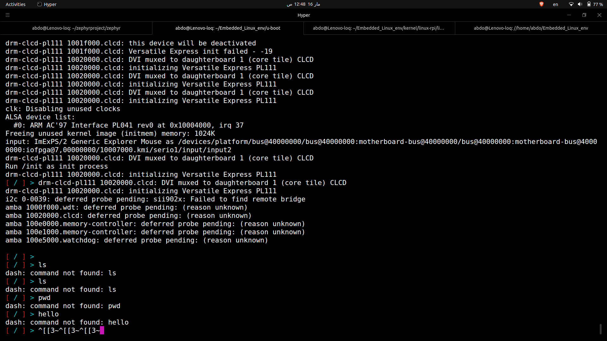
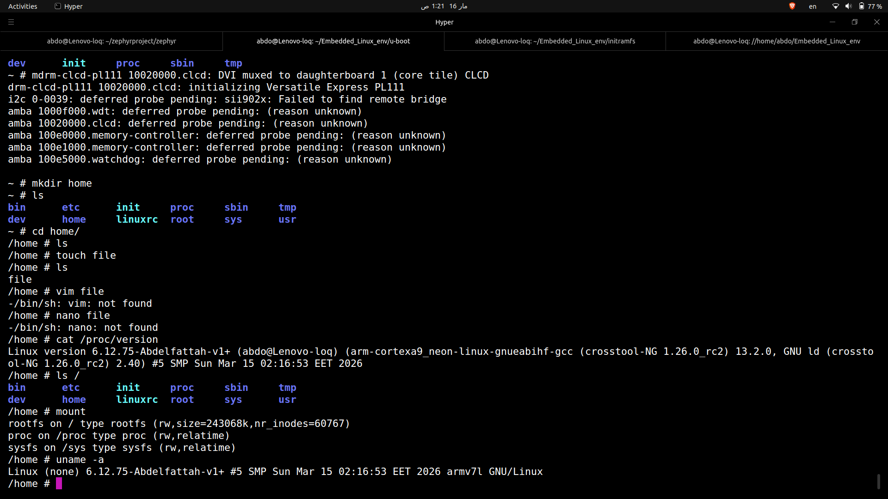

# Lab 7: Create Your Own Initramfs

## Table of Contents

1. [Objective](#objective)
2. [Environment](#environment)
3. [Theory: What is Initramfs?](#theory-what-is-initramfs)
4. [Theory: Initramfs vs Initrd](#theory-initramfs-vs-initrd)
5. [Theory: Boot Sequence](#theory-boot-sequence)
6. [Theory: BusyBox Architecture](#theory-busybox-architecture)
7. [Practical: Step-by-Step Build](#practical-step-by-step-build)
   - [Step 1: Verify Kernel Config](#step-1-verify-kernel-config)
   - [Step 2: Cross-Compile Dash](#step-2-cross-compile-dash)
   - [Step 3: Create Initramfs Skeleton](#step-3-create-initramfs-skeleton)
   - [Step 4: Pack CPIO Archive](#step-4-pack-cpio-archive)
   - [Step 5: Cross-Compile BusyBox](#step-5-cross-compile-busybox)
   - [Step 6: Create /etc/inittab](#step-6-create-etcinittab)
   - [Step 7: U-Boot Boot Script](#step-7-u-boot-boot-script)
   - [Step 8: Boot QEMU](#step-8-boot-qemu)
8. [Troubleshooting](#troubleshooting)
9. [Key Concepts Learned](#key-concepts-learned)
10. [Files](#files)

---

## Objective

Build a minimal initramfs from scratch, first using a statically linked `dash` shell,
then adding BusyBox for full Linux utilities. Boot it on QEMU vexpress-A9 via U-Boot
and reach a fully functional interactive shell prompt without kernel panic.

---

## Environment

| Component       | Details                                                    |
|-----------------|------------------------------------------------------------|
| Host OS         | Ubuntu 22.04 (x86_64)                                     |
| Target          | QEMU vexpress-A9 (ARM Cortex-A9, ARM32)                   |
| Toolchain       | arm-cortexa9_neon-linux-gnueabihf- (crosstool-NG 1.26.0)  |
| Kernel          | Linux 6.12.75-Abdelfattah-v1+                              |
| Shell (init)    | dash 0.5.12 (statically linked for ARM)                    |
| BusyBox         | Latest git (statically linked for ARM)                     |
| Bootloader      | U-Boot 2026.01-rc5-Abdelfattah-v1                         |
| RAM             | 512 MiB                                                    |

---

## Theory: What is Initramfs?

### Definition

initramfs (Initial RAM Filesystem) is a compressed **cpio archive** that the kernel
unpacks into a **tmpfs** (RAM-based filesystem) during early boot. It provides the
**first userspace environment** before any real storage device is mounted.

### Why Does It Exist?

The kernel faces a chicken-and-egg problem:
- To mount a root filesystem, it may need **drivers** (SCSI, USB, NFS, encryption)
- Those drivers might be compiled as **modules** (not built into the kernel)
- Modules live on the **root filesystem** that isn't mounted yet

initramfs solves this by providing a minimal environment that can:
1. Load necessary kernel modules
2. Discover and prepare the real root device
3. Mount the real root filesystem
4. `switch_root` to the real root and execute the real init

In our lab, initramfs IS the final root filesystem (no switch_root needed).

### How the Kernel Processes Initramfs

The kernel source code in `init/initramfs.c` does:

```
1. Check if bootloader passed an initrd/initramfs address
2. Read the first bytes to detect format:
   - Starts with "070701" or "070702" → cpio newc format → initramfs
   - Otherwise → legacy initrd (block device)
3. For initramfs: unpack cpio entries into rootfs (tmpfs)
4. Free the original compressed initramfs memory
5. Look for /init and execute it as PID 1
```

### What is PID 1?

PID 1 (Process ID 1) is the **first userspace process**. It's special:
- It's the ancestor of ALL other processes
- The kernel will **panic** if PID 1 exits or crashes
- It's responsible for reaping orphaned zombie processes
- In production: systemd, OpenRC, or BusyBox init
- In our lab: dash shell, then BusyBox init

---

## Theory: Initramfs vs Initrd

| Feature              | initrd (Legacy)                    | initramfs (Modern)                |
|----------------------|------------------------------------|-----------------------------------|
| Format               | Filesystem image (ext2) in ramdisk | cpio archive unpacked into tmpfs  |
| Kernel sees it as    | Block device (`/dev/ram0`)         | Files directly in rootfs (tmpfs)  |
| Needs FS driver?     | Yes (ext2 compiled into kernel)    | No (tmpfs is always available)    |
| Memory efficiency    | Double-buffered (block + page)     | Single copy in page cache         |
| Size                 | Fixed size                         | Grows/shrinks dynamically         |
| Default init         | `/linuxrc`                         | `/init`                           |
| Kernel config        | `CONFIG_BLK_DEV_INITRD=y`         | Same config option                |
| How kernel detects   | No cpio magic → legacy initrd      | cpio magic "070701" → initramfs   |

### Why initramfs Replaced initrd

```
initrd (old way):
  Compressed ext2 image → kernel allocates ramdisk block device
  → kernel mounts ext2 on /dev/ram0 → double memory usage
  → requires ext2 driver compiled into kernel

initramfs (new way):
  Compressed cpio → kernel unpacks directly into tmpfs
  → single copy in RAM → no block device needed
  → tmpfs is always available (no extra driver)
  → simpler, faster, more memory efficient
```

---

## Theory: Boot Sequence

### Complete Boot Flow (This Lab)

```
┌─────────────────────────────────────────────────────────────────┐
│  1.  QEMU powers on                                             │
│      → Loads U-Boot binary into RAM                             │
│                                                                 │
│  2.  U-Boot starts                                              │
│      → Initializes hardware (RAM, serial, network, MMC)         │
│      → Reads environment from SD card FAT partition             │
│      → Executes bootcmd                                         │
│                                                                 │
│  3.  U-Boot runs bootcmd                                        │
│      → tftp 0x60100000 zImage            (loads kernel)         │
│      → tftp 0x60000000 vexpress.dtb      (loads device tree)    │
│      → tftp 0x68000000 initramfs.cpio.gz (loads initramfs)      │
│      → bootz 0x60100000 0x68000000:SIZE 0x60000000              │
│                                                                 │
│  4.  Kernel starts                                              │
│      → Decompresses zImage                                      │
│      → Parses DTB (learns about hardware)                       │
│      → Parses bootargs: "console=ttyAMA0,115200 rdinit=/init"  │
│      → Initializes subsystems (memory, interrupts, drivers)     │
│                                                                 │
│  5.  Kernel processes initramfs                                 │
│      → Detects cpio format at 0x68000000                        │
│      → Decompresses gzip layer                                  │
│      → Unpacks cpio entries into rootfs (tmpfs)                 │
│      → Frees original initramfs memory                          │
│                                                                 │
│  6.  Kernel starts PID 1                                        │
│      → Opens /dev/console as fd 0, 1, 2 (stdin/stdout/stderr)  │
│      → Executes /init (rdinit=/init from bootargs)              │
│      → /init → busybox → acts as init                           │
│                                                                 │
│  7.  BusyBox init reads /etc/inittab                            │
│      → ::sysinit: mounts /proc and /sys                         │
│      → ::askfirst: spawns /bin/sh on console                    │
│                                                                 │
│  8.  Shell prompt appears                                       │
│      → "~ #"                                                    │
│      → Full BusyBox utilities available                         │
│      → NO KERNEL PANIC! 🎉                                     │
└─────────────────────────────────────────────────────────────────┘
```

### Memory Map During Boot

```
0x60000000  ┌──────────────────┐  ← DTB loaded here (~14KB)
            │  Device Tree Blob │
0x60004000  ├──────────────────┤
            │    (unused)       │
0x60100000  ├──────────────────┤  ← zImage loaded here (~5.9MB)
            │  Linux Kernel     │
            │  (compressed)     │
0x605A7000  ├──────────────────┤
            │    (unused)       │
0x68000000  ├──────────────────┤  ← initramfs.cpio.gz loaded here (~2-4MB)
            │  Initramfs        │
            │  (compressed)     │
0x68400000  ├──────────────────┤
            │    (unused)       │
0x80000000  └──────────────────┘  ← End of 512MB RAM
```

### Why No `root=` With Initramfs?

```
root=/dev/mmcblk0p2  → "Mount THIS block device as root filesystem"
                      → Requires a real storage device
                      → Used when rootfs is on disk/SD/NFS

With initramfs:
  → The cpio is unpacked INTO tmpfs
  → tmpfs IS ALREADY the root filesystem
  → There is no block device to mount
  → root= is meaningless and NOT needed

Our bootargs:
  console=ttyAMA0,115200    → where to send output
  rdinit=/init              → what to execute from initramfs
  (no root= needed!)
```

---

## Theory: BusyBox Architecture

### The Problem BusyBox Solves

```
Traditional Linux:          Embedded Linux with BusyBox:

/bin/ls      → 140KB        /bin/busybox   → ~2MB (ONE binary)
/bin/cat     → 40KB         /bin/ls        → symlink → busybox
/bin/mount   → 90KB         /bin/cat       → symlink → busybox
/bin/ps      → 130KB        /bin/mount     → symlink → busybox
/usr/bin/vi  → 1.2MB        /bin/ps        → symlink → busybox
... 300+ binaries            /usr/bin/vi    → symlink → busybox
Total: ~50MB+               ... 300+ symlinks
                             Total: ~2MB
```

### How argv[0] Dispatch Works

```c
// Simplified BusyBox main logic:

int main(int argc, char *argv[]) {
    // How was I invoked?
    const char *applet = basename(argv[0]);
    
    // Dispatch to the right function
    if (strcmp(applet, "ls") == 0)    return ls_main(argc, argv);
    if (strcmp(applet, "cat") == 0)   return cat_main(argc, argv);
    if (strcmp(applet, "init") == 0)  return init_main(argc, argv);
    if (strcmp(applet, "sh") == 0)    return ash_main(argc, argv);
    // ... 300+ applets
    
    // If called as "busybox" directly, show help
    printf("Usage: busybox [applet] [args]\n");
}
```

```
User types: ls /tmp
Kernel:     execve("/bin/ls", ["ls", "/tmp"], ...)
            /bin/ls is symlink → /bin/busybox
            So: execve("/bin/busybox", ["ls", "/tmp"], ...)
BusyBox:    argv[0] = "ls" → run ls_main() → list /tmp contents
```

### make install Creates This Structure

```
make CONFIG_PREFIX=/path/to/initramfs install

Creates:
  /path/to/initramfs/
  ├── bin/
  │   ├── busybox          ← THE actual binary (~2MB)
  │   ├── ash → busybox    ← symlink (shell)
  │   ├── cat → busybox    ← symlink
  │   ├── ls → busybox     ← symlink
  │   ├── mount → busybox  ← symlink
  │   ├── sh → busybox     ← symlink
  │   └── ... (100+ symlinks)
  ├── sbin/
  │   ├── init → ../bin/busybox   ← symlink (PID 1)
  │   ├── reboot → ../bin/busybox
  │   ├── ifconfig → ../bin/busybox
  │   └── ... (50+ symlinks)
  ├── usr/bin/
  │   ├── vi → ../../bin/busybox
  │   └── ... (100+ symlinks)
  └── usr/sbin/
      └── ... (more symlinks)
```

---

## Practical: Step-by-Step Build

### Step 1: Verify Kernel Config

```bash
grep CONFIG_BLK_DEV_INITRD ~/linux/.config
```

**Command breakdown:**

| Part | Purpose |
|------|---------|
| `grep` | Search for a pattern in a file |
| `CONFIG_BLK_DEV_INITRD` | The kernel config option for initramfs/initrd support |
| `~/linux/.config` | Kernel's saved configuration file |

**Expected output:**
```
CONFIG_BLK_DEV_INITRD=y
```

If `=n` or missing, enable it:

```bash
cd ~/linux
make ARCH=arm CROSS_COMPILE=arm-cortexa9_neon-linux-gnueabihf- menuconfig
```

| Part | Purpose |
|------|---------|
| `make` | Build system command |
| `ARCH=arm` | Target architecture is ARM 32-bit |
| `CROSS_COMPILE=...` | Prefix for all toolchain commands (gcc, ld, etc.) |
| `menuconfig` | Interactive ncurses-based configuration menu |

Navigate: `General setup → [*] Initial RAM filesystem and RAM disk support`

---

### Step 2: Cross-Compile Dash

```bash
cd ~/Embedded_Linux_env/shells/dash
```

```bash
~/x-tools/arm-cortexa9_neon-linux-gnueabihf/bin/arm-cortexa9_neon-linux-gnueabihf-gcc \
    -Wall -static -o dash dash.c
```

**Command breakdown:**

| Part | Purpose |
|------|---------|
| `~/x-tools/.../arm-cortexa9_neon-linux-gnueabihf-gcc` | Cross-compiler targeting ARM Cortex-A9 |
| `-Wall` | Enable **all** common compiler warnings |
| `-static` | Link **statically** — embed all library code into the binary. No dependency on shared libs (.so files). Without this, the binary would need `/lib/ld-linux-armhf.so.3` and `/lib/libc.so.6` at runtime, which don't exist in our minimal initramfs |
| `-o dash` | Output filename is `dash` |
| `dash.c` | Source file to compile |

**Verification commands:**

```bash
file dash
```

| Part | Purpose |
|------|---------|
| `file` | Identify file type by reading magic bytes in the header |
| `dash` | The binary to inspect |

**Must show:** `ELF 32-bit LSB executable, ARM, EABI5 ... statically linked`

```bash
~/x-tools/.../arm-cortexa9_neon-linux-gnueabihf-readelf -d dash
```

| Part | Purpose |
|------|---------|
| `readelf` | Display information about ELF binary files |
| `-d` | Show dynamic section (shared library dependencies) |
| `dash` | The binary to inspect |

**Must show:** `There is no dynamic section in this file.`

### Why Static Linking is Required

```
Dynamic linking (FAILS in minimal initramfs):
  Kernel executes /init (dash)
  → ELF loader reads: "INTERP: /lib/ld-linux-armhf.so.3"
  → Kernel looks for /lib/ld-linux-armhf.so.3
  → FILE NOT FOUND (initramfs has no /lib/)
  → exec fails with ENOENT (error -2)
  → Kernel panic: "No working init found"

Static linking (WORKS):
  Kernel executes /init (dash)
  → ELF has no INTERP section
  → All code is self-contained in the binary
  → Only needs kernel syscalls (always available)
  → Executes successfully ✅
```

---

### Step 3: Create Initramfs Skeleton

```bash
cd ~/Embedded_Linux_env
mkdir -p initramfs/{bin,sbin,dev,proc,sys,etc,tmp}
```

**Command breakdown:**

| Part | Purpose |
|------|---------|
| `mkdir` | Create directories |
| `-p` | Create parent directories as needed, no error if they exist |
| `initramfs/{bin,sbin,dev,proc,sys,etc,tmp}` | **Brace expansion** — creates 7 directories inside initramfs/ |

Brace expansion means this single command creates:
```
initramfs/bin
initramfs/sbin
initramfs/dev
initramfs/proc    ← mount point for procfs
initramfs/sys     ← mount point for sysfs
initramfs/etc     ← configuration files
initramfs/tmp     ← temporary files
```

**Copy dash binary:**

```bash
cp ~/Embedded_Linux_env/shells/dash/dash initramfs/bin/dash
chmod 755 initramfs/bin/dash
```

| Command | Purpose |
|---------|---------|
| `cp src dst` | Copy file |
| `chmod 755` | Set permissions: owner=rwx, group=rx, others=rx. The binary must be **executable** or the kernel can't run it |

Permission breakdown: `755` = `rwxr-xr-x`
```
7 = 4(read) + 2(write) + 1(execute) → owner
5 = 4(read) + 0(write) + 1(execute) → group
5 = 4(read) + 0(write) + 1(execute) → others
```

**Create symlinks:**

```bash
cd initramfs
ln -sf bin/dash init
ln -sf ../bin/dash sbin/init
```

| Part | Purpose |
|------|---------|
| `ln` | Create a link |
| `-s` | **Symbolic** link (soft link) — a file that points to another path |
| `-f` | **Force** — overwrite if target already exists |
| `bin/dash` | Target the symlink points to (relative path) |
| `init` | Name of the symlink to create |

Why two symlinks:
```
/init           → bin/dash    ← kernel default: looks for /init in initramfs
/sbin/init      → ../bin/dash ← fallback: if rdinit=/sbin/init is used
```

The kernel's init lookup order:
1. `rdinit=` parameter from bootargs (our case: `rdinit=/init`)
2. `/init` (default for initramfs)
3. `/sbin/init` (fallback)
4. `/etc/init` (fallback)
5. `/bin/init` (fallback)
6. `/bin/sh` (last resort)
7. **Kernel panic** if none found

**Create device nodes:**

```bash
sudo mknod -m 666 dev/console c 5 1
sudo mknod -m 666 dev/null c 1 3
```

**Detailed command breakdown:**

| Part | Purpose |
|------|---------|
| `sudo` | Run as root — required because only root can create device nodes |
| `mknod` | **Make node** — create a special file (device node) |
| `-m 666` | Set permissions to `rw-rw-rw-` (everyone can read/write) |
| `dev/console` | Path where the device node is created |
| `c` | **Character** device (as opposed to `b` for block device) |
| `5` | **Major** number — identifies the driver (5 = tty driver) |
| `1` | **Minor** number — identifies the specific device (1 = console) |

Device numbers explained:
```
/dev/console  → c 5 1
                │ │ └─ minor 1 = the system console
                │ └─── major 5 = tty/console driver
                └───── c = character device (byte-by-byte I/O)

/dev/null     → c 1 3
                │ │ └─ minor 3 = /dev/null
                │ └─── major 1 = memory devices driver
                └───── c = character device

Character vs Block devices:
  Character (c): byte-by-byte I/O (console, serial, null)
  Block (b):     block-by-block I/O (disks, SD cards)
```

Why /dev/console is critical — kernel source `init/main.c`:
```c
// Before executing /init, kernel does:
ksys_open("/dev/console", O_RDWR, 0);  // fd 0 = stdin
ksys_dup(0);                            // fd 1 = stdout = console
ksys_dup(0);                            // fd 2 = stderr = console
// Now PID 1 has working I/O
```

Without `/dev/console`: init has no stdin/stdout/stderr → no shell prompt visible.

---

### Step 4: Pack CPIO Archive

```bash
cd ~/Embedded_Linux_env/initramfs

find . -print0 | cpio --null -ov --format=newc --owner root:root \
    | gzip -9 > ../initramfs.cpio.gz
```

**This is 3 commands piped together:**

```
find . -print0
    │ (pipe: filenames with NULL separators)
    ▼
cpio --null -ov --format=newc --owner root:root
    │ (pipe: raw cpio archive binary stream)
    ▼
gzip -9 > ../initramfs.cpio.gz
    (compressed file saved to disk)
```

**Command 1: `find . -print0`**

| Part | Purpose |
|------|---------|
| `find` | Recursively search for files/directories |
| `.` | Start from current directory |
| `-print0` | Print each result separated by NULL (`\0`) character instead of newline |

Why `-print0`?
```
Normal find output (newline-separated):
  ./bin/dash\n./dev/console\n...
  Problem: if filename contains space/newline, parsing breaks

find -print0 output (NULL-separated):
  ./bin/dash\0./dev/console\0...
  Safe: NULL can never appear in a filename
```

**Command 2: `cpio --null -ov --format=newc --owner root:root`**

| Flag | Purpose |
|------|---------|
| `cpio` | Archive tool (Copy In/Out) |
| `--null` | Expect NULL-separated input (matches `find -print0`) |
| `-o` | **Output** mode = CREATE archive (vs `-i` = extract, `-p` = passthrough) |
| `-v` | **Verbose** — print each file being added to archive |
| `--format=newc` | Use SVR4 "new ASCII" cpio format |
| `--owner root:root` | Set all files to UID 0 / GID 0 (root) in the archive |

Why `--format=newc`?
```
cpio has multiple formats:
  bin   → old binary (obsolete)
  odc   → old POSIX.1 (obsolete)
  newc  → SVR4 new ASCII ← ONLY format Linux kernel understands!
  tar   → tar format

The kernel's initramfs unpacker (init/initramfs.c) ONLY parses newc.
It looks for magic bytes "070701" at the start of each cpio header.
```

CPIO archive internal structure:
```
[header "070701"][filename "bin/dash"][file data bytes]
[header "070701"][filename "dev/console"][device info]
[header "070701"][filename "init"][symlink target "bin/dash"]
...
[header "070701"][filename "TRAILER!!!"][end marker]
```

**Command 3: `gzip -9 > ../initramfs.cpio.gz`**

| Part | Purpose |
|------|---------|
| `gzip` | GNU zip compression |
| `-9` | Maximum compression level (1=fastest, 6=default, 9=smallest output) |
| `>` | Redirect stdout to a file |
| `../initramfs.cpio.gz` | Save ONE directory UP (so archive doesn't include itself) |

Why `..`?
```
We're inside: ~/Embedded_Linux_env/initramfs/
We save to:   ~/Embedded_Linux_env/initramfs.cpio.gz

If we saved INSIDE initramfs/, the next "find ." would include
the archive itself, creating an infinite recursion problem.
```

**Verification command:**

```bash
zcat ~/Embedded_Linux_env/initramfs.cpio.gz | cpio -tv
```

| Part | Purpose |
|------|---------|
| `zcat` | Decompress gzip to stdout (like `gunzip -c`) |
| `\|` | Pipe decompressed data to cpio |
| `cpio` | Archive tool |
| `-t` | **List** contents (don't extract) |
| `-v` | **Verbose** — show permissions, sizes, dates |

---

### Step 5: Cross-Compile BusyBox

**Clone source:**

```bash
cd ~/Embedded_Linux_env
git clone https://github.com/mirror/busybox.git
cd busybox
```

| Command | Purpose |
|---------|---------|
| `git clone <url>` | Download entire repository with full history |
| `cd busybox` | Enter the source directory |

**Set environment variables:**

```bash
export CROSS_COMPILE=~/x-tools/arm-cortexa9_neon-linux-gnueabihf/bin/arm-cortexa9_neon-linux-gnueabihf-
export ARCH=arm
```

| Command | Purpose |
|---------|---------|
| `export CROSS_COMPILE=...` | Set prefix for all toolchain tools. When make calls `${CROSS_COMPILE}gcc`, it becomes `arm-...-gcc`. Persists for entire shell session |
| `export ARCH=arm` | Tell the build system we're targeting ARM 32-bit |

What `CROSS_COMPILE` prefix does:
```
make internally calls:
  ${CROSS_COMPILE}gcc     → arm-cortexa9_neon-linux-gnueabihf-gcc
  ${CROSS_COMPILE}ld      → arm-cortexa9_neon-linux-gnueabihf-ld
  ${CROSS_COMPILE}strip   → arm-cortexa9_neon-linux-gnueabihf-strip
  ${CROSS_COMPILE}objcopy → arm-cortexa9_neon-linux-gnueabihf-objcopy
```

**Default configuration:**

```bash
make defconfig
```

| Part | Purpose |
|------|---------|
| `make` | Run the build system |
| `defconfig` | Generate a **default** configuration with most applets enabled. Creates `.config` file |

**Interactive configuration:**

```bash
make menuconfig
```

| Part | Purpose |
|------|---------|
| `menuconfig` | Opens ncurses-based interactive menu to customize settings |

**Critical settings enabled:**
```
Settings --->
    [*] Build static binary (no shared libs)    ← REQUIRED
    [ ] SHA1: hardware accelerated              ← MUST DISABLE (x86-only)
    [ ] SHA256: hardware accelerated            ← MUST DISABLE (x86-only)
```

Why disable SHA hardware acceleration:
```
defconfig was written for x86 hosts.
SHA-NI instructions exist only on x86 CPUs.
ARM Cortex-A9 doesn't have these instructions.
Build fails: 'sha1_process_block64_shaNI' undeclared
Solution: disable hardware SHA acceleration → uses software implementation
```

**Build:**

```bash
make -j$(nproc)
```

| Part | Purpose |
|------|---------|
| `make` | Compile the project |
| `-j` | Run parallel jobs |
| `$(nproc)` | Subshell that returns number of CPU cores (e.g., 8) |
| Combined: `-j8` | Run 8 compile jobs in parallel → much faster build |

**Verify the binary:**

```bash
file busybox
```

**Must show:** `ELF 32-bit LSB executable, ARM, EABI5 ... statically linked`

**Install into initramfs:**

```bash
make CONFIG_PREFIX=~/Embedded_Linux_env/initramfs install
```

| Part | Purpose |
|------|---------|
| `CONFIG_PREFIX=.../initramfs` | **Destination directory** — where to install busybox and create symlinks |
| `install` | Make target that copies the binary and creates all symlinks |

What this command creates:
```
initramfs/bin/busybox         ← actual binary (only real file, ~2MB)
initramfs/bin/ls → busybox    ← symlink
initramfs/bin/cat → busybox   ← symlink
initramfs/bin/sh → busybox    ← symlink
initramfs/sbin/init → ../bin/busybox  ← symlink
initramfs/sbin/mount → ../bin/busybox ← symlink
... 300+ symlinks total
initramfs/linuxrc → bin/busybox  ← for legacy initrd compatibility
```

**Fix /init symlink after BusyBox install:**

```bash
cd ~/Embedded_Linux_env/initramfs
rm -f init
ln -sf bin/busybox init
```

Now `/init → busybox`, and busybox sees `argv[0] = "init"` → runs as init system.

---

### Step 6: Create /etc/inittab

```bash
cat > ~/Embedded_Linux_env/initramfs/etc/inittab << 'EOF'
::sysinit:/bin/mount -t proc proc /proc
::sysinit:/bin/mount -t sysfs sysfs /sys
::askfirst:-/bin/sh
::restart:/sbin/init
::shutdown:/bin/umount -a -r
EOF
```

**Command breakdown:**

| Part | Purpose |
|------|---------|
| `cat >` | Write stdin to a file (overwrite) |
| `<< 'EOF'` | **Here document** — everything until `EOF` is written to the file. Single quotes around `EOF` prevent variable expansion |

**inittab format:** `id:runlevel:action:process`

For BusyBox init, the format is simplified: `id::action:process`

| Line | Action | Purpose |
|------|--------|---------|
| `::sysinit:/bin/mount -t proc proc /proc` | `sysinit` | Run ONCE at startup. Mounts procfs (process info) |
| `::sysinit:/bin/mount -t sysfs sysfs /sys` | `sysinit` | Run ONCE at startup. Mounts sysfs (kernel/device info) |
| `::askfirst:-/bin/sh` | `askfirst` | Like `respawn` but prints "Please press Enter to activate this console" first. The `-` prefix means: create a **login shell** (runs profile scripts) |
| `::restart:/sbin/init` | `restart` | What to execute when init receives SIGHUP (restart signal) |
| `::shutdown:/bin/umount -a -r` | `shutdown` | Run during shutdown. Unmount all filesystems (`-a`), remount read-only if busy (`-r`) |

Why we needed inittab — without it, BusyBox init uses defaults:
```
Default BusyBox init behavior (no inittab):
  ::sysinit:/etc/init.d/rcS
  ::askfirst:/bin/sh          ← on /dev/console
  tty2::askfirst:/bin/sh      ← tries /dev/tty2 → FAILS → error spam
  tty3::askfirst:/bin/sh      ← tries /dev/tty3 → FAILS → error spam
  tty4::askfirst:/bin/sh      ← tries /dev/tty4 → FAILS → error spam

Our inittab: only spawn shell on console → no tty error spam!
```

**Mount commands explained:**

```bash
mount -t proc proc /proc
```

| Part | Purpose |
|------|---------|
| `mount` | Attach a filesystem to a directory |
| `-t proc` | Filesystem **type** is procfs (virtual, no real device) |
| `proc` | Device name (for virtual FS, this is a label — convention) |
| `/proc` | **Mount point** — directory where the filesystem appears |

```
After mounting:
  /proc/version     ← kernel version string
  /proc/cpuinfo     ← CPU information
  /proc/meminfo     ← memory statistics
  /proc/[PID]/      ← per-process information
  /proc/cmdline     ← kernel boot arguments
```

---

### Step 7: U-Boot Boot Script

**Set environment variables in U-Boot:**

```bash
setenv bootargs "console=ttyAMA0,115200 rdinit=/init"
```

| Parameter | Purpose |
|-----------|---------|
| `console=ttyAMA0,115200` | Kernel console output goes to UART serial port (PL011) at 115200 baud. ttyAMA0 = ARM AMBA PL011 UART #0 |
| `rdinit=/init` | After unpacking initramfs, execute `/init` as PID 1. `rd` = ramdisk, `init` = init process. Without this, kernel defaults to `/init` anyway, but being explicit is good practice |

```bash
setenv bootcmd "tftp 0x60100000 zImage; tftp 0x60000000 vexpress-v2p-ca9.dtb; tftp 0x68000000 initramfs.cpio.gz; bootz 0x60100000 0x68000000:\${filesize} 0x60000000"
```

**Detailed breakdown of bootcmd:**

| Command | Purpose |
|---------|---------|
| `tftp 0x60100000 zImage` | Download kernel from TFTP server, store at RAM address 0x60100000 |
| `tftp 0x60000000 vexpress-v2p-ca9.dtb` | Download device tree blob, store at 0x60000000 |
| `tftp 0x68000000 initramfs.cpio.gz` | Download initramfs, store at 0x68000000. After this, U-Boot sets `${filesize}` to the number of bytes downloaded |
| `bootz 0x60100000 0x68000000:\${filesize} 0x60000000` | Boot zImage kernel with initrd and DTB |

**bootz syntax:**
```
bootz <kernel_addr> <initrd_addr>:<initrd_size> <dtb_addr>

bootz 0x60100000    0x68000000:${filesize}      0x60000000
      │             │          │                 │
      │             │          │                 └─ DTB address
      │             │          └─ Size in bytes (set by last tftp)
      │             └─ Initramfs start address
      └─ Kernel start address
```

**Critical: `\${filesize}` escape:**
```
❌ ${filesize}   → Expanded at setenv time → EMPTY (no tftp has run yet)
                   Result: bootz ... 0x68000000: 0x60000000
                   Kernel gets size=0 → empty initramfs → panic

✅ \${filesize}  → The backslash escapes the $
                   Stored literally as ${filesize} in the variable
                   Expanded at RUNTIME after tftp sets it
                   Result: bootz ... 0x68000000:1449184 0x60000000
                   Kernel gets correct size → works! ✅
```

**Save environment:**

```bash
saveenv
```

Saves all `setenv` variables to persistent storage (FAT partition on SD card).
Next boot, U-Boot reads them back automatically.

---

### Step 8: Boot QEMU

```bash
sudo qemu-system-arm \
    -M vexpress-a9 \
    -kernel ~/Embedded_Linux_env/u-boot/u-boot \
    -sd ~/path/to/sd.img \
    -m 512M \
    -nographic \
    -nic tap,script=./script \
    -net nic
```

**Command breakdown:**

| Flag | Purpose |
|------|---------|
| `sudo` | Required for TAP networking |
| `qemu-system-arm` | QEMU emulator for ARM systems |
| `-M vexpress-a9` | **Machine** type: ARM Versatile Express with Cortex-A9 |
| `-kernel u-boot` | Load U-Boot as the "kernel" (first thing QEMU executes) |
| `-sd sd.img` | Attach SD card image (contains U-Boot environment + boot files) |
| `-m 512M` | **Memory**: 512 MiB RAM |
| `-nographic` | No graphical window — all I/O through terminal (serial console) |
| `-nic tap,script=./script` | **Network**: TAP interface for TFTP communication with host |
| `-net nic` | Create a network interface card in the virtual machine |

---

## Final Initramfs Structure

```
initramfs/
├── bin/
│   ├── busybox                ← THE single binary (~2MB, static ARM)
│   ├── ash → busybox          ← symlink (ash shell)
│   ├── cat → busybox          ← symlink
│   ├── dash                   ← original static dash from Step 2
│   ├── ls → busybox           ← symlink
│   ├── mount → busybox        ← symlink
│   ├── sh → busybox           ← symlink
│   └── ... (100+ symlinks)
├── dev/
│   ├── console                ← char device (major 5, minor 1)
│   └── null                   ← char device (major 1, minor 3)
├── etc/
│   └── inittab               ← BusyBox init configuration
├── init → bin/busybox         ← kernel executes this as PID 1
├── linuxrc → bin/busybox      ← legacy initrd compatibility
├── proc/                      ← mount point for procfs
├── root/                      ← root user home directory
├── sbin/
│   ├── init → ../bin/busybox  ← fallback init path
│   ├── reboot → ../bin/busybox
│   └── ... (50+ symlinks)
├── sys/                       ← mount point for sysfs
├── tmp/                       ← temporary files
└── usr/
    ├── bin/                   ← additional command symlinks
    └── sbin/                  ← additional admin symlinks
```

---

## Troubleshooting

| Symptom | Cause | Fix |
|---------|-------|-----|
| `Kernel panic: No working init found` | `/init` missing or broken | Verify: `ls -la initramfs/init` |
| `Failed to execute /init (error -2)` | Binary not found at symlink target | Check symlink points to existing file |
| `Failed to execute /init (error -8)` | Wrong architecture or not executable | Verify with `file` command — must be ARM static |
| `Loading Ramdisk to X, end X` (same addr) | `${filesize}` was empty at setenv time | Use `\${filesize}` (escaped) |
| `Wrong Ramdisk Image Format` | Missing `:${filesize}` in bootz | Must be `addr:size` format |
| `can't open /dev/tty2/3/4` | BusyBox init default config tries virtual consoles | Create `/etc/inittab` |
| `can't open /dev/console` | Missing device node | `sudo mknod -m 666 dev/console c 5 1` |
| `sha1_process_block64_shaNI undeclared` | x86 SHA-NI enabled for ARM build | Disable SHA hardware acceleration in menuconfig |
| No output after `Starting kernel` | Wrong console parameter | Use `console=ttyAMA0,115200` |
| TFTP timeout | Network misconfigured | Check TAP interface and TFTP server |

---

## Key Concepts Learned

| Concept | What I Learned |
|---------|----------------|
| **initramfs** | Compressed cpio archive unpacked into tmpfs; provides first userspace |
| **initrd** | Legacy approach using ext2 image in ramdisk block device |
| **Static linking** | Embeds all library code into binary; required when no shared libs exist |
| **Device nodes** | Special files that connect userspace to kernel drivers via major/minor numbers |
| **/dev/console** | Required for PID 1 to have stdin/stdout/stderr |
| **cpio newc format** | Only archive format the Linux kernel's initramfs unpacker accepts |
| **PID 1** | First userspace process; kernel panics if it exits |
| **BusyBox** | Single binary implementing 300+ commands via argv[0] dispatch |
| **argv[0] dispatch** | BusyBox reads its own name to decide which applet to run |
| **CONFIG_PREFIX** | BusyBox install target: copy binary + create all symlinks |
| **inittab** | BusyBox init configuration: controls what runs at boot |
| **bootz** | U-Boot command: boot zImage with optional initrd and DTB |
| **\${filesize}** | Must escape in setenv so it's evaluated at runtime, not at definition time |
| **rdinit=/init** | Kernel parameter specifying which file to execute from initramfs |
| **tmpfs/rootfs** | RAM-based filesystem; initramfs lives here; no block device needed |
| **root= not needed** | initramfs IS the root; no block device to mount |

---

## Files

| File | Description |
|------|-------------|
| `initramfs/` | Complete initramfs root directory |
| `initramfs.cpio.gz` | Compressed cpio archive (~2-4MB) |
| `shells/dash/dash` | Statically linked dash binary (ARM) |
| `busybox/busybox` | Statically linked BusyBox binary (ARM) |
| `initramfs/etc/inittab` | BusyBox init configuration |

---

## 1. initramfs with dash shell only

## 2. initramfs with BusyBox
