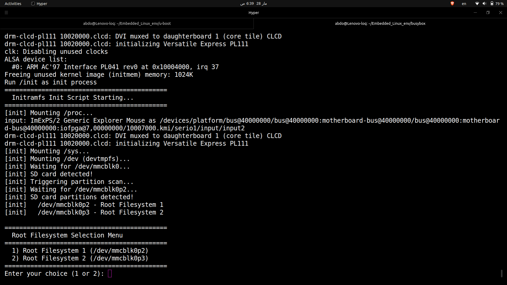
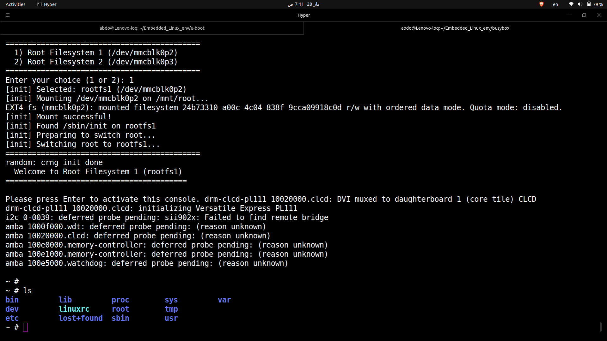
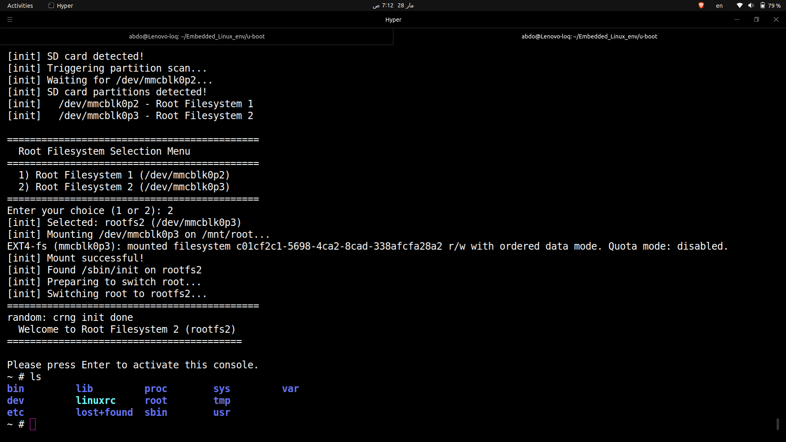

# Initramfs-Based Root Filesystem Selection

## What This Project Does

A custom initramfs that acts as a **boot menu** — it lets the user choose between two root filesystem partitions on an SD card during boot.

Instead of booting directly into a fixed root filesystem, the initramfs:
1. Initializes the system (mounts /proc, /sys, /dev)
2. Waits for the SD card to be detected
3. Shows a menu with two rootfs options
4. Mounts the user's choice
5. Uses `switch_root` to hand off control to the real root filesystem

## Key Files

| File | Purpose |
|------|---------|
| `dual_partion_initramfs/init` | The boot menu script (PID 1 in initramfs) |
| `rootfs1/etc/inittab` | BusyBox init config — prints "Welcome to rootfs1" |
| `rootfs2/etc/inittab` | BusyBox init config — prints "Welcome to rootfs2" |
| `rootfs{1,2}/etc/rootfs-id` | Identity file to verify which rootfs booted |

## How to Rebuild

### 1. Repack Initramfs
```bash
cd ~/Embedded_Linux_env/initRamFS/dual_partion_initramfs
find . -print0 | cpio --null -ov --format=newc --owner root:root \
    | gzip -9 > ../initramfs.cpio.gz
cp ../initramfs.cpio.gz ~/tftpboot/
```

### 2. Modify Root Filesystems
```bash
sudo losetup -fP --show ~/Embedded_Linux_env/initRamFS/image/sd.img
# Note the /dev/loopXX number
sudo mount /dev/loopXXp2 /mnt/rootfs1    # rootfs1
# ... make changes ...
sudo umount /mnt/rootfs1
sudo mount /dev/loopXXp3 /mnt/rootfs2    # rootfs2
# ... make changes ...
sudo umount /mnt/rootfs2
sudo losetup -d /dev/loopXX
```

### 3. Recompile BusyBox for ARM
```bash
cd ~/Embedded_Linux_env/busybox
export CROSS_COMPILE=~/x-tools/arm-cortexa9_neon-linux-gnueabihf/bin/arm-cortexa9_neon-linux-gnueabihf-
export ARCH=arm
make clean && make defconfig && make menuconfig
# Enable: static binary, Disable: SHA hardware acceleration
make -j$(nproc)
file busybox   # MUST show: ARM, EABI5, statically linked
```

### 4. Boot QEMU
```bash
cd ~/Embedded_Linux_env/u-boot
sudo qemu-system-arm \
    -M vexpress-a9 \
    -kernel u-boot \
    -sd ~/Embedded_Linux_env/initRamFS/image/sd.img \
    -m 512 \
    -nographic \
    -nic tap,script=./script \
    -net nic
```

### 5. U-Boot Commands (type manually, DO NOT saveenv)
```
setenv serverip 192.168.1.100
setenv ipaddr 192.168.1.50
setenv bootargs "console=ttyAMA0,115200 rdinit=/init"
tftp 0x60100000 zImage
tftp 0x60000000 vexpress-v2p-ca9.dtb
tftp 0x68000000 initramfs.cpio.gz
bootz 0x60100000 0x68000000:${filesize} 0x60000000
```

## Required Kernel Configs
```
CONFIG_BLK_DEV_INITRD=y     # initramfs support
CONFIG_DEVTMPFS=y            # auto-create /dev nodes
CONFIG_EXT4_FS=y             # mount ext4 partitions
CONFIG_MMC=y                 # SD card support
CONFIG_MMC_ARMMMCI=y         # ARM PL180 MMC driver
CONFIG_MSDOS_PARTITION=y     # MBR partition table parsing
```

## Lessons Learned (Pitfalls)

| Problem | Cause | Solution |
|---------|-------|----------|
| `error -8 (ENOEXEC)` | BusyBox compiled for x86, not ARM | Always verify with `file busybox` |
| `saveenv` destroys partition table | U-Boot env overwrites MBR sector 0 | Don't use `saveenv`, type commands manually |
| `/dev/mmcblk0p*` never appear | MBR was corrupted by saveenv | Recreate partition table with `sfdisk` |
| `mdev: not found` | Initramfs had only minimal symlinks | Install full BusyBox into initramfs |
| `sudo make install` copies x86 binary | `sudo` loses CROSS_COMPILE env var | Use `sudo cp /absolute/path/busybox` instead |
| Kernel panic no init found | initramfs not passed to kernel correctly | Use `bootz addr addr:${filesize} addr` format |

## Key Concepts

| Concept | Summary |
|---------|---------|
| **initramfs** | Compressed cpio archive unpacked into RAM — first userspace environment |
| **switch_root** | Replaces initramfs with real rootfs, frees RAM, maintains PID 1 |
| **devtmpfs** | Kernel auto-creates device nodes when hardware is detected |
| **mdev -s** | BusyBox device manager — scans /sys to create missing /dev entries |
| **PID 1** | First process, kernel panics if it dies — `exec` ensures continuity |
| **Static linking** | No shared library dependencies — required for minimal environments |
| **cpio newc** | Only archive format the Linux kernel accepts for initramfs |


## Boot Flow Diagram

```
┌─────────────────────────────────────────────────────────────────────┐
│                        POWER ON (QEMU)                              │
└──────────────────────────────┬──────────────────────────────────────┘
                               │
                               ▼
┌─────────────────────────────────────────────────────────────────────┐
│                          U-BOOT                                     │
│                                                                     │
│  1. Initializes hardware (RAM, serial, MMC, network)                │
│  2. TFTP downloads 3 files into RAM:                                │
│     • zImage          → 0x60100000  (kernel)                        │
│     • vexpress.dtb    → 0x60000000  (device tree)                   │
│     • initramfs.cpio.gz → 0x68000000 (initial filesystem)          │
│  3. bootz hands control to kernel                                   │
└──────────────────────────────┬──────────────────────────────────────┘
                               │
                               ▼
┌─────────────────────────────────────────────────────────────────────┐
│                       LINUX KERNEL                                  │
│                                                                     │
│  1. Decompresses zImage                                             │
│  2. Parses DTB (learns hardware layout)                             │
│  3. Initializes drivers (MMC, serial, memory)                       │
│  4. Detects cpio magic "070701" → unpacks initramfs into tmpfs      │
│  5. Opens /dev/console as stdin/stdout/stderr                       │
│  6. Executes /init as PID 1                                         │
└──────────────────────────────┬──────────────────────────────────────┘
                               │
                               ▼
┌─────────────────────────────────────────────────────────────────────┐
│                    /init SCRIPT (PID 1)                              │
│                    (runs from initramfs in RAM)                      │
│                                                                     │
│  1. mount -t proc proc /proc          ← process info               │
│  2. mount -t sysfs sysfs /sys         ← kernel/device info         │
│  3. mount -t devtmpfs devtmpfs /dev   ← auto-create device nodes   │
│  4. Wait for /dev/mmcblk0             ← SD card appears            │
│  5. mdev -s                           ← scan & create partitions   │
│  6. Wait for /dev/mmcblk0p2           ← partitions appear          │
│  7. Display menu to user:                                           │
│     ┌─────────────────────────────────────┐                         │
│     │  1) Root Filesystem 1 (mmcblk0p2)   │                         │
│     │  2) Root Filesystem 2 (mmcblk0p3)   │                         │
│     └─────────────────────────────────────┘                         │
│  8. Read user choice                                                │
│  9. mount -t ext4 /dev/mmcblk0pX /mnt/root                         │
│ 10. Verify /sbin/init exists on new root                            │
│ 11. Unmount /proc, /sys, /dev                                       │
│ 12. exec switch_root /mnt/root /sbin/init                           │
└──────────────────────────────┬──────────────────────────────────────┘
                               │
              ┌────────────────┴────────────────┐
              │ switch_root:                     │
              │  • Deletes initramfs (frees RAM) │
              │  • Moves /mnt/root → /           │
              │  • exec /sbin/init (stays PID 1) │
              └────────────────┬────────────────┘
                               │
                 ┌─────────────┴──────────────┐
                 ▼                            ▼
┌──────────────────────────┐  ┌──────────────────────────┐
│  ROOTFS 1 (/dev/mmcblk0p2) │  │  ROOTFS 2 (/dev/mmcblk0p3) │
│                          │  │                          │
│  BusyBox init reads      │  │  BusyBox init reads      │
│  /etc/inittab:           │  │  /etc/inittab:           │
│                          │  │                          │
│  • Mounts /proc, /sys    │  │  • Mounts /proc, /sys    │
│  • Prints:               │  │  • Prints:               │
│  "Welcome to rootfs1"    │  │  "Welcome to rootfs2"    │
│  • Spawns /bin/sh        │  │  • Spawns /bin/sh        │
│                          │  │                          │
│  ~ # ← SHELL PROMPT 🎉  │  │  ~ # ← SHELL PROMPT 🎉  │
└──────────────────────────┘  └──────────────────────────┘
```

# Screenshots



